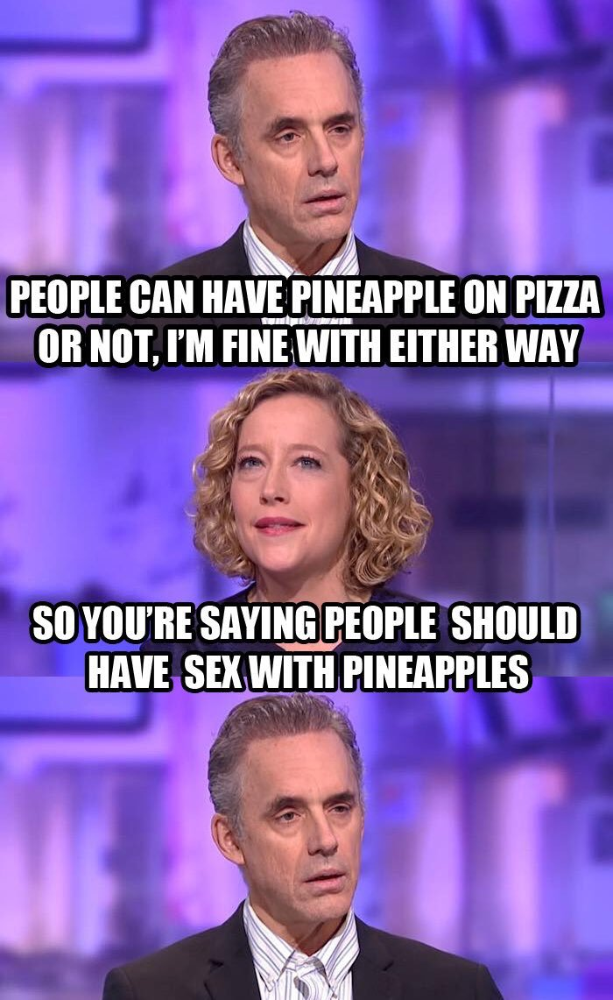

# 

Perhaps the best general answer to this question was offered many years ago by Rowland W. Jepson in a book he wrote on the subject of thinking: When we have once adopted an opinion, our pride makes us loth to admit that we are wrong. When objections are made to our views, we are more concerned with discovering how to combat them than how much truth or sound sense there may be in them; we are at pains rather to find fresh support for our own views, than to face frankly any new facts that appear to contradict them. We all know how easy it is to become annoyed at the suggestion that we have made a mistake; that our first feeling is that we would rather do anything than admit it, and our first thought is “How can I explain it away?”This determination to explain away whatever does not flatter us or our point of view reflects our urge to save face and preserve our self- image.

## Automatic rejection

As critical thinkers we need a reasonable basis for accepting or rejecting any argument or claim, including challenges to our ideas. The only way to establish that basis is to evaluate the challenge and make an honest determination of its worth. Liking or disliking it, feeling pleased or displeased with it, is not enough. To reject criticism without giving it a fair hearing is to commit the error of automatic rejection. The temptation to automatically reject challenges to your ideas can be powerful. 

A good way to lessen that temptation is to put some emotional distance between your ideas and your ego. Think of them as possessions that you can keep or discard rather than as extensions of your self. This will make you less defensive about them.

## Changing the Subject 

Changing the subject consists of abruptly turning a discussion in a different direction. Not every shift constitutes an error. The new direction may be more promising. Or it may be a way to provide a timely but polite rebuke. Suppose someone asks you a rude or inappropriately personal question, such as “What is your annual income?” or “Why don’t you and your spouse have any children?” Having no obligation to reply, you might say something totally unrelated to the question, Changing the subject is an error only when the original issue is appropriate and the shift is used deceptively. Sadly, this kind of shift is common in interviews of public figures 

To avoid this error, face difficult questions head-on. If you know the answer, state it. If the issue is too complex to permit a certain answer, state what you believe to be probable and explain your reasoning. If you lack sufficient knowledge to speak of probabilities, say so. No reasonable person will think less of you for candidly admitting ignorance.

## Shifting the Burden of Proof 

The error of shifting the burden of proof consists of demanding that others disprove our assertions. Let’s say Bill asserts, “The greatest single cause of exploding health care costs in this country is unnecessary referral of patients for costly medical testing.” Barbara then asks Bill to explain why he believes that to be the case. He responds, “Can you cite any evidence to disprove it? If you can’t, then say so.” Bill is guilty of shifting the burden of proof. He made an assertion; he should be ready to support it if asked and not demand that others refute it. The rule is that whoever makes the assertion bears the burden of supporting it, and the more the assertion departs from what knowledgeable people believe, the greater the responsibility of the person making the assertion to support it. 

You will be less likely to shift the burden of proof if you learn to expect your ideas to be questioned and criticized and prepare to support them before you express them. 

## Straw Man 

你说的明明是A，他却把你说的等效成B —— 然后因为B不好，所以他说你说的不好，由此引发争论。他攻击的不是原本的你，而是他想象出来的一个稻草人。

去年一个电视节目里，女主持人凯茜·纽曼（Cathy Newman）对彼得森的访问，整个的对话简直是教科书般的稻草人攻击。

https://www.youtube.com/watch?v=aMcjxSThD54

The term straw man was coined by logicians to denote an argument with- out substance. To commit the error of straw man is to put false words in someone else’s mouth and then expose their falsity, conveniently forgetting that the other person never said them. 

Suppose you are discussing with a friend whether the sale of assault weapons should be banned and the conversation goes as follows: 

You: I oppose any restriction on the sale of guns. It should make no difference whether we’re talking about a pistol, a rifle, a shotgun, or an assault weapon. A gun is a gun. And a constitutional right is a constitutional right. 

your friend: You say it “should make no difference” what kind of gun is involved. I say it should make a difference because the guns you mentioned are very different from one another. Assault weapons are unlike other kinds of guns—they are not designed for hunting, or even for self-defense, but only for killing people, often indiscriminately. That’s why they should be banned. 

You [feeling defensive because you realize your friend’s point will be difficult to answer]: So you believe you should decide what weapons are acceptable and what weapons aren’t. It’s exactly this kind of arrogance by self-appointed social reformers that everyone who values the Constitution should fear. 

You have committed the error of straw man. If your friend is alert, she will respond: “First you put irresponsible words in my mouth, and then you say I’m irresponsible. I’d prefer to hear your reaction to what I really said.” 

To avoid straw man, be scrupulously accurate in quoting or para- phrasing other people’s words. 

## Attacking the Critic 

Attacking the critic is the attempt to discredit an idea or argument by disparaging the person who expressed it. People typically resort to this error of reaction after their ideas or behaviors have been called into question. Instead of responding to the real issue, the actual ideas or behaviors that have been questioned, they create a diversionary issue—the real or imagined failings, or the motivation, of the person who raised the issue. 

Attacking the critic is an error because ideas and people are not synonymous. However interesting it may be to probe people’s motives, such exploration tells us nothing about the quality of their ideas. Even people with questionable motives and outright liars sometimes tell the truth. This is not to say that honesty is unimportant or that we should unquestioningly accept the word of people whose integrity we have reason to suspect. It is only to say that it is unreasonable to substitute speculations or judgments about people themselves for judgments of their ideas. 

## Vocabulary

loth adj 不乐意的; 不情愿的

frankly adv 坦率地

preserve vt 保护，保存

deceptively adv 迷惑地；骗人地

candidly adv 坦白地; 率直地;

temptation n 诱惑

referral n 送交，转送

assault vt 猛烈攻击，袭击，

pistol n手枪

indiscriminately adv 随意地；不加选择地

Paraphrase  vt 解释，释义，意译

probe vt 追问; 探究

substitute vt; n 代替; 取代

determination n 决定

contradict vt 反驳; 驳斥

automatic adj 自动的，自发的

Extension  n   延伸，延展

