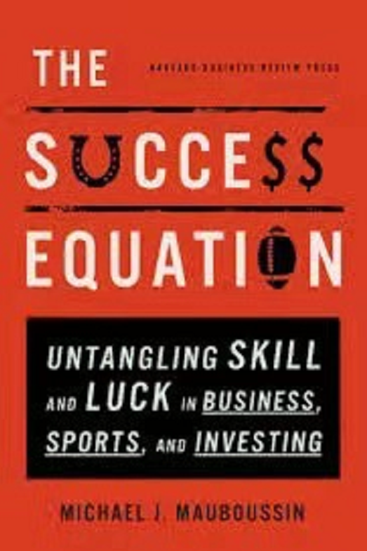
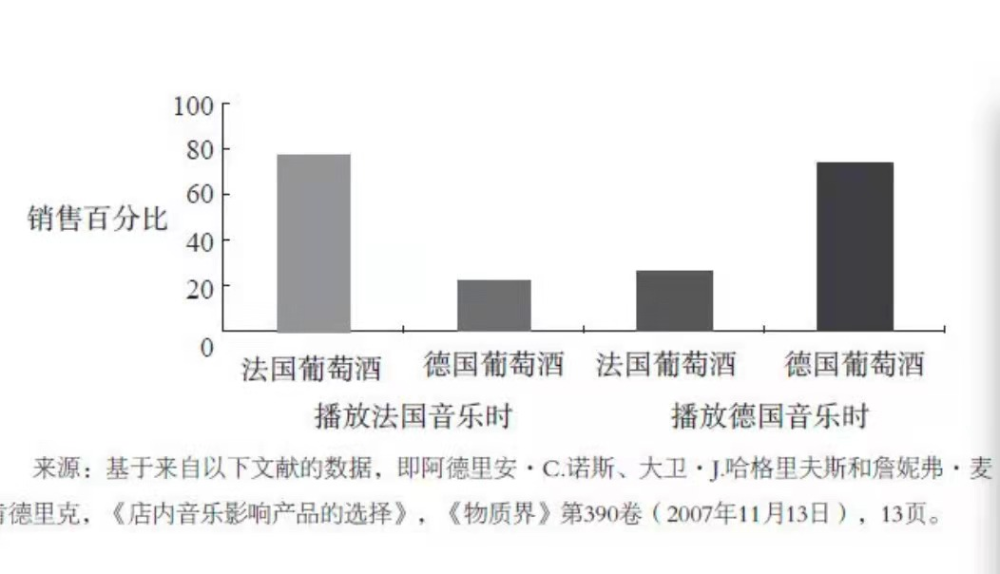
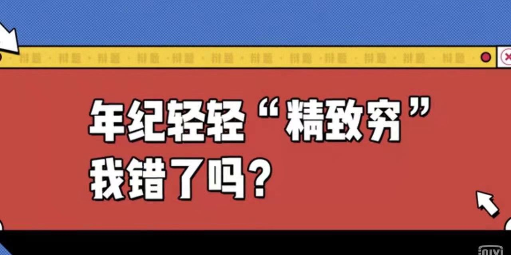
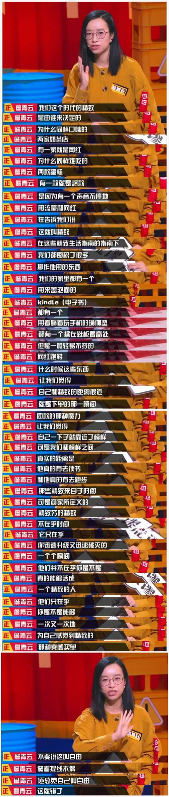

# 逻辑通识课

## 1、进入逻辑的世界

### 形式逻辑

大前提、小前提、结论

举例：人都会死的

川普是人

所以川普也会死的

### 非形式逻辑（重点）

处理不确定性的问题

举例：大部分政客是骗子

川普是政客

川普多大程度上是个骗子？

### 认知偏差

> 参考第5轮和第6轮。

处理的是不确定性问题，以他的主观的感受而不是客观的事实而建立的”主观现实“，是他自以为是的现实。

丹尼尔卡尼曼

举例：追妹子。没有追到妹子，反而抹黑妹子

伊索寓言里狐狸吃不到葡萄就说葡萄酸。

学英语：放弃的学生会说英语学好了也没啥用，不是照样的普通。

对于钱的态度：赚不到很多钱的时候，有钱了不起啊，有钱人有贪婪、又狡诈……

**认知失调**：当现实与预期不一致时，很多人开始改变自己的看法。改变看法相对改变行为，当然改变看法更容易。

以上这些情况并不能改变学好英语就是很有用，赚到钱就是很好啊……

### 科学知识

逻辑严谨本身并不能得出正确的结论。如果前提假设错了的话，通过缜密的逻辑分析得出一个与正确结论截然相反的结论。

举例：脑叶切除手术可以治愈神经病，但是病人无法做决定、无法长期思考。虽然不是疯子了，但是变成了傻子。

错误的前提假设：激情和情感是人们心里的错误，必须加以克服和修复。比如一个人是散漫的，不守规矩的，他缺乏控制自己感情的能力，理性必须介入清理混乱。

实际上情绪功能受损，决策能力也会受损。

如何思考、如何提问、如何选择，你不会害怕不确定性，你会与不确定性共舞。

> 塔勒布 《反脆弱》

## 2、什么是独立思考？

### 思维模式的三个阶段	

- 无知的确定性

  盲目相信的阶段

- 有知的混乱性

  接触到了各种各样的知识、流派

  举例：企业管理

  由于企业太复杂了，所以需要顶层设计，谋定而后动

  正因为企业太复杂了，所以我们要不断迭代，在错误中进步。精益创业

- 独立思考

  举例：复眼

  蜜蜂在亮出寻找出处

  苍蝇胡乱飞，结果从瓶口出去了

  独立思考:只不过在当前的环境下，局面对苍蝇更有效。

   无论是谁，一根筋终究会倒霉的。

### 什么是独立思考？

独立思考是能够思考和评估思考的过程和结果是否合理

独立思考的本质是评估，评估的别人的结论，思考自己的思考过程

独立思考者特征：善于提问，能够控制自己的心智

### 对于独立思考的误解
- 有推理能力，就有独立思考的能力
- 独立思考者从来不模仿别人
- 独立思考着脑子里有很多正确的答案
- 独立思考是天生的。

## 3、为什么这个时代需要独立思考？

感觉和思考是不一样的，是互补的。

There is an unfortunate tendency among many to view feeling and thought as mutually exclusive, to force a choice between them. If we focus on one, then in their view we must reject the other. But this is mistaken. Feeling and thought are perfectly complementary. Feeling, being more spontaneous, is an excellent beginning to the development of conclusions. And thought, being more deliberate, provides a way to identify the best and most appropriate feeling. Both are natural. Thinking, however, is less automatic than feeling. To do it well demands a systematic approach and guided practice.

车夫、黑马、白马

### 投资

感觉：价格跌了就要割肉

思考：真正的收益来自于未来漫长的熊市

**没有独立思考能力，凭运气赚到的钱，凭实力亏掉。**

> 一切的学习和进步都是在大脑里的完成的，
>
> 一切的调整或修正都是大脑完成的，
>
> 一切的危险感知和风险躲避都是大脑完成的，
>
> 一切的不可控的危险的情绪都是大脑产生的，
>
> 一切的猜想推理与长期之后的验证也都是在自己的脑子里发生发酵而终结的……
>
> 总而言之，一切都发生在我们的大脑之中。
>
> 来自《定投改变命运》第一版

### 广告

我们生活在一个过度宣扬感觉的时代，生活在一个被操控的时代。

我们周围广告满天飞。广告商都是心理学大师。

> 肤浅就是深刻
>
> 伤害就是有益
>
> 邪恶就是美德

商店播放的音乐会影响我们买酒。

当我们买了酒了以后，我们还会自己给一些理由。

年纪轻轻精致穷我错了？

精致穷我错了，这是对感觉经济的抨击。

> 我们这个时代的精致究竟是由谁来决定的？
>
> 为什么同样口味的两家奶茶店，有一家就是网红；
>
> 为什么同样难吃的两款蛋糕，有一款就是爆款；
>
> 为什么到某个湖就叫发呆，去某个湖发呆就叫浪漫；
>
> 是因为有个声音不停的用流量和网红在告诉我们说这就叫精致。

> 在这些精致生活指南的指导下，我们都囤积了很多挪作他用的东西。
>
> 我们的家里都有一个盖泡面的kindle，都有一个躺着来玩手机的瑜伽垫，都有一个摆在鞋柜最高处但是轻易不穿的网红跑鞋。
>
> 什么时候这些东西让我们觉得自己和精致的距离很近。
>
> 就是在下单的那一瞬间同款的那种魔力让我们觉着自己一下子就靠近了榜样。
>
> 可是我们和榜样的之间的距离是他真的有在读书、他真的有去跑步……
>
> 那些精致来自于时间。
>
> 可是商家所定义的精致穷的精致不在乎时间，他只在乎
>
> 你迅速升级又迅速破灭的瞬间一个个瞬间
>
> 他们并不在乎你是不是真的能够活成一个精致的人
>
> 他们只在乎你是不是能够一次又一次地为自己感觉到的精致的那种爽感买单。
>
> 不要说这叫自由
>
> 做着提线木偶还感觉自己叫自由
>
> 这错了。

你现在需要的东西，是你真的需要吗？

实际上，你被塑造了，被植入了，你被PUA了。

**我们生活在感觉经济中，我们需要独立思考，需要我们超越感觉。**

###  PUA

感情的非理性诉求

> PUA，全称是Pick-up Artist，这是起源于美国的“搭讪艺术”，原本是用于男女两性交往的一套方法，后被引申为一种包含控制、操纵、凌虐他人精神的情感骗术。这个东西被别有用心的人利用，变成了用洗脑、诱骗、威胁、心理暗示等一系列精神控制手段，来欺骗异性的感情和钱财，甚至掌控对方的人生。施压者打着“为你好”的幌子，通过“打压-赞赏-打压”的形式，使他人自尊受损、自我判断和自我认知出现偏差，从而达到在精神控制他人的目的。被PUA者往往容易情绪低落、自卑、自我怀疑，甚至走向自我毁灭。这套控制方法的核心是，摧毁对方的自我判断能力和意志，然后完全掌控对方。

举例：包丽自杀前，其男友牟林翰向包丽提出过拍裸照、先怀孕再流产留下病历单、做绝育手术等要求。包丽母亲称，两人恋爱期间，牟林翰嫌弃包丽有过恋爱经历，不是处女，但又不想分手，却以此折磨包丽。

职场PUA是指一系列精神控制方法，它多发生在上司和下属之间，用来让下属丧失自我，摧毁你的自信心和判断力，最终对公司唯命是从。职场PUA的表现通常是：

- “你太差了，什么都做不好”——通过否定来实施精神打压
- “你还年轻，不要想那么多”——灌输虚无缥缈的希望
- “在我手下工作是你的福气！”——营造狂热崇拜
- “这全是你的错！”——颠倒是非，当众羞辱

怎么处理职场PUA?

>一份职场白领心理调查显示，中国有64%的职场人都遭遇过职场PUA，长此以往，会对我们的正常心理造成不可挽回的精神伤害。那么我们该如何应对职场PUA呢？
>
>**坚定信念：上司并不是评判你能力和价值的唯一标准**
>
>领导、老板、上司，这些人只在你人生的某一个阶段扮演角色，他们没有权力和能力否定你的整个人生。
>
>**果断行动：打开自己的信息通路**
>
>在许多职场PUA的案例里，实施PUA的人都有一个共同操作：关闭受害者的信息通路。兼听则明，旁听则暗。当你发现有人刻意屏蔽你的信息通路时，一定要警惕，然后勇敢采取行动，打开信息通路。
>
>比如拓展自己的职场交际圈，和不同的朋友聊自己的经历，多看看相关的书籍甚至寻求一些专业咨询帮助，这都能帮你认清楚眼前的这个人到底是为你好，还是想控制你。
>
>当观点越多，信息越全面时，你就越能辨别是非，判断出对方的话有没有道理。切莫一个人胡思乱想，学会借助周围人的力量帮助你走出思维牢笼。
>
>**培养勇气：不要害怕辞职**
>
>根据相关调查显示，一个人一生平均要经历7份工作。跟人生的长河比起来，眼下的工作并非不可替代，未来的道路永远都充满未知的惊喜。 　

https://wiki.mbalib.com/wiki/%E8%81%8C%E5%9C%BAPUA

